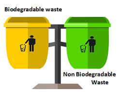

# Trash-Classifier
It is an automated waste classification system using Convolution Neural Network (CNN) algorithm, a Deep Learning based image classification model used to classify objects into bio and non-biodegradable, based on the object recognition accuracy in real-time.   

### PROTOTYPE DESIGN:
CNN is the most appropriate image classification method,which can be
implemented in python with the help of libraries such as Theano,
*Tensorflow, Numpy, Matplotlib, Pillow and opencv.*   
The methodology of waste segregation using this deep learning algorithm
are:
a. Library Installation
b. Model Preparation
c. Frozen inference graph
d. Process of displaying image
e. Classify waste of image

### PROJECT BENEFITS:

This idea of fully automated waste segregation (Trash classifier) using deep learning can be done without involving manual work.
Thus this approach, aids in reducing pollution levels and in the long run focuses on the development of universal waste segregation framework.

### UNIQUENESS OF THE PROJECT:
With the advent of deep network architectures that deals with Big Data, this solution provides the best in class performance in terms of accuracy, scalability, adaptability without any feature engineering.
